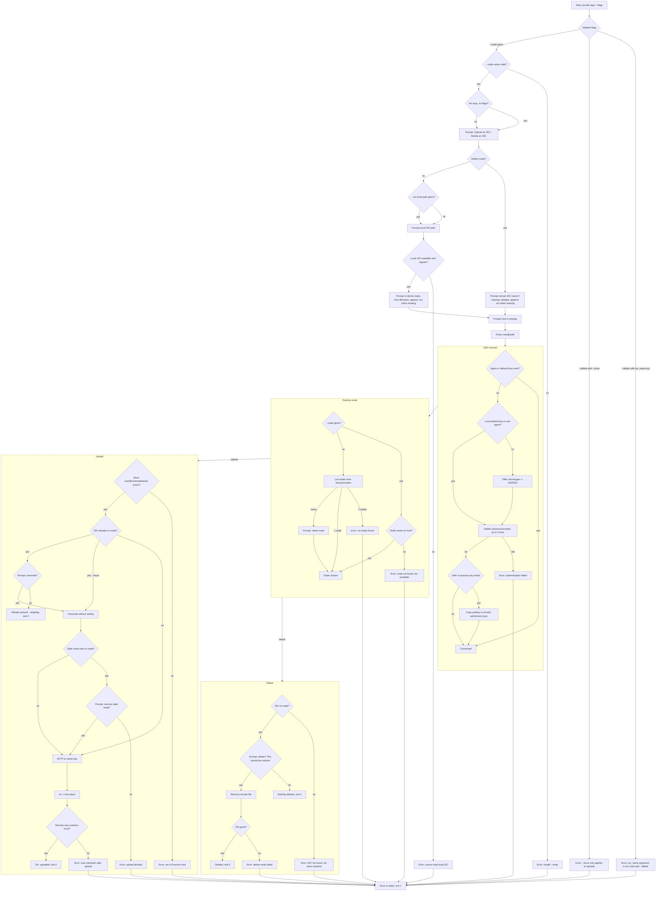

# proxdk

Manage ISOs in a Proxmox node's local ISO store over SSH. Style inspiration: GitHub's `gh` — flat cobra command, positional arguments, interactive prompts when values are missing.

## Usage

```
Upload:  proxdk [host] [iso_name] --node <node> --iso <local_path> [-F]
Delete:  proxdk [host] --node <node> --iso <remote_name> -D
         proxdk                                             (fully interactive)
```

- `[host]` is `user@addr`; the user defaults to `root` when omitted. Prompted when missing.
- Interactive prompts are a Bubble Tea TUI: ↑/↓ + Enter to pick from a list, `y`/`n`/Enter for confirmations, type into text fields. Ctrl+C aborts the current prompt (`Error: interrupted`). Prompts require a TTY; each answered prompt stays in the terminal transcript.
- `[iso_name]` is the upload-only optional name; it defaults to the local filename. Prompted when missing.
- `--node` names a Proxmox cluster node and is required for non-interactive use. Interactive mode lists nodes from the host at runtime.
- `--iso` is a LOCAL path for upload and a REMOTE name for delete.
- `-D/--delete` removes an ISO from the node's store; always asks for confirmation.
- `-F/--force` skips the overwrite confirmation on upload. Rejected together with `-D`.
- Target store: `/var/lib/vz/template/iso` (the installer-default `local` store).
- Auth flow: agent + default keys → generate a key if none exists (offered) → hidden password prompt → offer in-process key install → reconnect by key.
- Upload is atomic: SFTP to `<name>.tmp`, then `mv -f` into place; the size is verified after. A leftover `<name>.tmp` from an interrupted run is only removed after confirmation.
- Exit codes: 0 on success (including "already present — skipping"), 1 on any error.

## Safety

proxdk mutates a Proxmox node's ISO store, which provisions VM boot media — treat it as vital hardware state. The tool is built so no remote command can be sent that is not explicitly allowed:

- **Remote command allowlist.** Every remote shell command goes through one gate (`runRemote` in `guard.go`) and must match exactly one of: `ls /etc/pve/nodes`, `echo $HOME`, or the atomic upload finalize `mv -f <store>/<name>.tmp <store>/<name>`. Anything else is refused before any network I/O. Callers pass tokens, never pre-built command strings; the gate quotes each token, so no value can add commands.
- **Name character set.** Node and ISO names may contain only ASCII letters, digits, and `._@%+=:,-`. Names with `/`, whitespace, quotes, or shell metacharacters are rejected before any connection is made.
- **Store confinement.** All SFTP access goes through the `remoteFS` wrapper (`guard.go`), which exposes only stat/list/upload/remove inside `/var/lib/vz/template/iso` and the `authorized_keys` append under a validated remote `$HOME`. The raw SFTP client is never exposed, so an operation or path outside these is unrepresentable, not just rejected.
- **Explicit user authorization.** Upload runs on invocation, overwrite requires `-F` or confirmation, delete always asks, a stale temp is removed only after confirmation, key install and first-contact host trust ask, and Ctrl+C aborts any prompt (`Error: interrupted`).

## CLI flow


